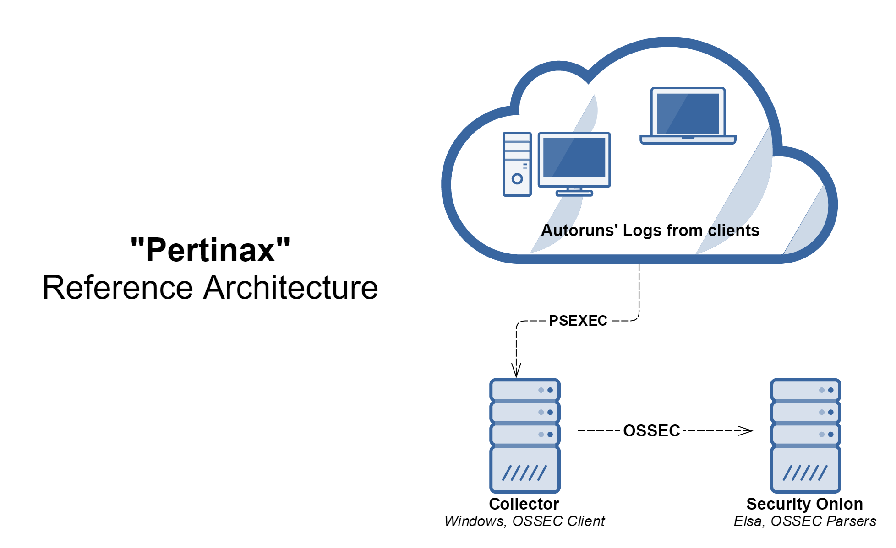
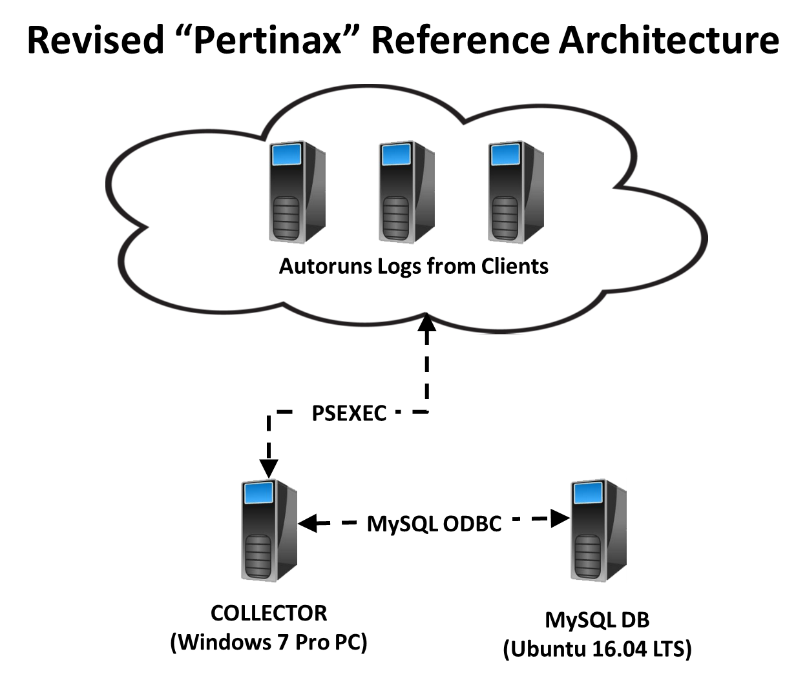
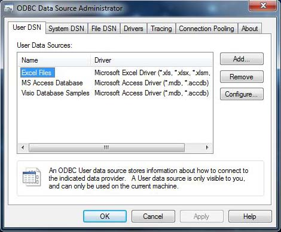
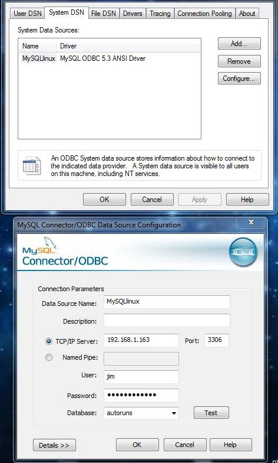
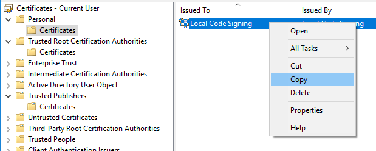
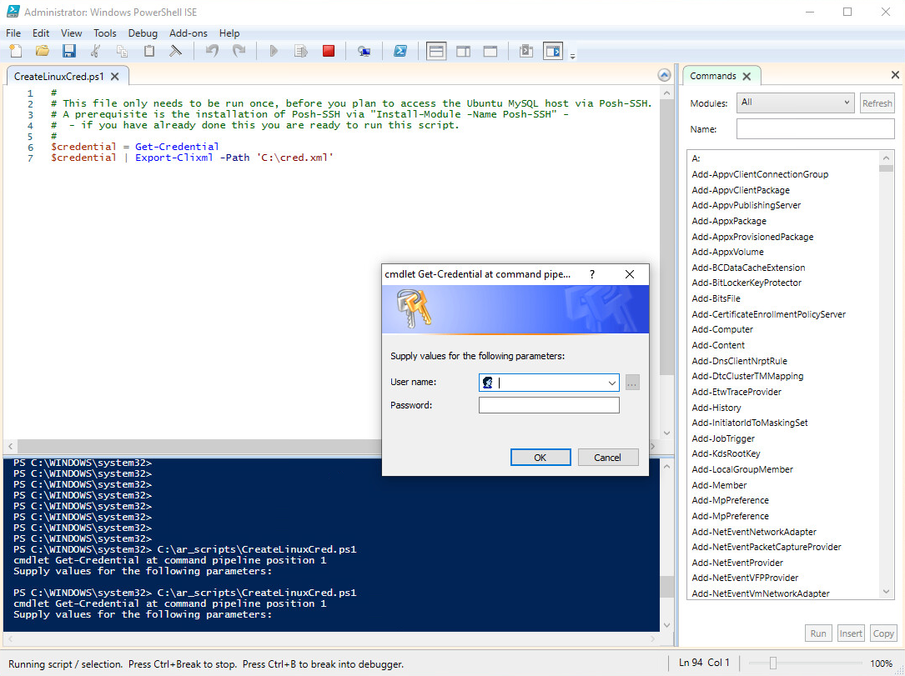

# Using Autoruns, Powershell and MySQL To Identify Malware

## Abstract
This document discusses how to monitor multiple Windows 7/10 hosts for areas that are used to start processes at boot up. These areas are where malware often modifies to achieve persistence. The document describes how use scripts (using PowerShell), Microsoft Sysinternals “AutoRuns” application, and an Ubuntu Linux MySQL database to perform daily checks on these locations to identify changes. Baselines of each host are stored on the Linux MySQL database. The scripts are used each day to compare the daily run to the baseline for purposes of identifying changes. A web server is installed on the same Linux server as the MySQL server to create a daily "Delta Report" to be viewed on the LAN via a browser. Daily delta reports are also sent via Slack to the appropriate user.

Over time a new baseline is likely to be needed due to changes to the Autoruns list of changes due to automatic software updates and manual installs. This will cause the list of items for each host to become large. Once the items have been investigated a new baseline can be created by a provided script.

Copies of all data collected, both daily and baselines, are stored in a zip archives stored in the ar_archive folder.

## Description
First some background.

In the SANS Institute InfoSec Reading Room there is a paper - [**Utilizing “AutoRuns” To Catch Malware**, by Jim McMillan](https://www.sans.org/white-papers/33383/). The paper is dated 2010. The paper explains the usefulness of running the [**Sysinternals “Autoruns” application**, by Mark Russinovich](https://docs.microsoft.com/en-us/sysinternals/downloads/autoruns). The paper goes on to explain how to automate the command line version of the “Autoruns” application (autorunsc) to be run remotely from a central computer to get “snapshots” of any changes to these computers from a specific “baseline” using a command **diff.exe**. The paper describes a **VBScript** to perform some of the automation. The paper is a good reference for a method to catch malware that imbeds itself into the autoruns area for persistence.

[Josh Brower created Perintax in Sept. 2016](https://groups.google.com/forum/#!topic/security-onion/agrweZfrhGA) which was a similar approach that was later integrated into [Security Onion](https://securityonion.net/ ). As best I can find, Josh never wrote any paper on his approach but there is some documentation on his [github site](https://github.com/defensivedepth/Pertinax ). Josh did present the approach at a SOC Augusta in 2016 titled ["Uncovering Persistence with Autoruns & Security Onion”](https://www.youtube.com/watch?v=LT45m30Ev4s&list=PLljFlTO9rB15Tve-LhV5k_5_0HH37eALe&index=4). Josh’s approach utilized a “Collector” computer that summarized the Autoruns data from all the client hosts. The Collector then used an OSSEC Client to send this summary of a daily delta to an OSSEC parser which was part of a [Security Onion install](https://github.com/Security-Onion-Solutions/security-onion/wiki/QuickISOImage ).



Josh’s approach was to use a batch file and PowerShell scripts (ar-diff.ps1 and ar-normalize.ps1) to perform the comparisons for the daily deltas. Setting all this up was in my opinion not as clear as I would hope, so I decided to modify his approach.

This document describes a variation to the Perintax approach that uses both Windows PowerShell based scripts and a Linux based MySQL database to store the baselines. Using the MySQL database makes checking the difference from the baseline less of a text comparison operation. In this system all machines are running either Windows 7/10 Pro or Windows 2012. The system does not use an Active Directory server – every machine has local administration. This is a configuration that many small offices may be using. As of this writing, I have not completed the integration of this approach with my Security Onion installation. Having all the autoruns data stored in a DB enables the creation of other tools. One example would be to create a script that identifies differences in objects between hosts.



## Contents: 
<ol>
  <li><b>Preparing the Windows 7/10 hosts</b></li>
    <ol>
	  <li>Create Directory Folders</li>
      <li>Set “path” Variable</li>
      <li>Install “AutoRuns”</li>
      <li>Install “PsTools”</li>
      <li>Verify Hosts are Running PowerShell v5.1</li>
      <li>Enable PowerShell Remoting</li>
	</ol>
  <li><b>Select a Windows 7/10 Host to be the Collector</b></li>
    <ol>
	  <li>Install PowerShell Scripts</li>
	  <li>Create a List of Computers to Include</li>
	  <li>Install the MySQL ODBC Connector</li>
	  <li>Configure the MySQL ODBC Connector</li>
	</ol>
  <li><b>Create an Ubuntu 16.04 LTS host that runs a MySQL server</b></li>
    <ol>
	  <li>Configure a Static IP</li>
	  <li>Install MySQL DB</li>
	  <li>Create a MySQL DB User and Allow Remote Access</li>
	  <li>Create the MySQL DB (as root)</li>
	  <li>Create a DB Table (ar_data)</li>
	  <li>MySQL DB Notes</li>
	  <li>Install Apache Web Server and Configure it for Windows Reports</li>
	</ol>
  <li><b>Setup Slack for Delta Reports</b></li>
  <li><b>Appendix A - Enable PS Remoting</b>*</li>
  <li><b>Appendix B - MySQL Scripts</b></li>
  <li><b>Appendix C - PowerShell Code Signing</b></li>
  <li><b>Appendix D - Create RSA keypair and Export it to Windows Collector</b></li>
  <li><b>Appendix E - Install Webserver on Linux and Configure it for Autoruns Reports</b></li>
  <li><b>Appendix F - Windows Collector PowerShell Module Installs and Configuration</b></li>
  <li><b>Appendix G - List of Windows PowerShell Scripts Used</b></li>
</ol>

## 1. Preparing the Windows 7/10 hosts
There are several steps necessary on all the hosts and the Collector host where the PowerShell scripts are installed.

### 1.1.	Create Directory Folders
Create the following folders at **C:\ **
•	ar_archive
•	ar_baselies
•	ar_latest
•	ar_scripts
•	sysinternals\autoruns
•	sysinternal\pstools

### 1.2.	Set “path” Variable
Select **Control Panel -> All Control Panel Items -> System **

Then select **Advanced system settings**. A **System Properties** popup should be displayed. Click on the **Environment Variables…** button. In the bottom area labeled **System variables** highlight the Variable **Path** and click the **Edit...** button. An **Edit environment variable** popup should be displayed. Click the **New** button. Paste the below text into the new text box and click the **OK** button to update the variable.:
```console
C:\sysinternals\autoruns\
```
Repeat these steps for the following path:
```console
C:\sysinternals\pstools\
```

### 1.3.	Install “AutoRuns”
Download the latest version of [“Autoruns”](https://docs.microsoft.com/en-us/sysinternals/downloads/autoruns) .

Unzip the files and copy them to **C:\sysinternals\autoruns**. The following is a list of files:
<ul>
  <li>autoruns.chm</li>
  <li>autoruns.exe</li>
  <li>autoruns64.exe</li>
  <li>autorunsc.exe</li>
  <li>autorunssc64.exe</li>
  <li>eula.txt</li>
</ul>

### 1.4.	Install “PsTools”
Download the latest version of [“PsTools”](https://docs.microsoft.com/en-us/sysinternals/downloads/pstools ).

Unzip the files and copy them to **C:\sysinternals\pstools**. The following is a list of files:
<ul>
  <li>Eula.txt</li>
  <li>PsExec.exe</li>
  <li>PsExec64.exe</li>
  <li>psfile.exe</li>
  <li>psfile64.exe</li>
  <li>PsGetsid.exe</li>
  <li>PsGetsid64.exe</li>
  <li>PsInfo.exe</li>
  <li>PsInfo64.exe</li>
  <li>pskill.exe</li>
  <li>pskill64.exe</li>
  <li>pslist.exe</li>
  <li>pslist64.exe</li>
  <li>PsLoggedon.exe</li>
  <li>PsLoggedon64.exe</li>
  <li>psloglist.exe</li>
  <li>pspasswd.exe</li>
  <li>pspasswd64.exe</li>
  <li>psping.exe</li>
  <li>psping64.exe</li>
  <li>PsService.exe</li>
  <li>PsService64.exe</li>
  <li>pshutdown.exe</li>
  <li>pssupend.exe</li>
  <li>pssupend64.exe</li>
  <li>Pstools.chm</li>
  <li>Psversion.txt</li>
</ul>

### 1.5.	Verify Hosts are Running PowerShell > v5.1
```console
PS C:\> $PSVersionTable.PSVersion

Major  Minor  Build  Revision
-----  -----  -----  --------
5      1      14409     1012
```

If the hosts are not running v5.1, update them to at least this version. Microsoft refers to this as Windows Management Framework 5.1. You can directly download it from this [link](https://www.microsoft.com/en-us/download/details.aspx?id=54616).

### 1.6.	Enable PowerShell Remoting
```console
PS C:\> Enable-PSRemoting –Force
```

See Appendix A if you have problems setting up remoting.

## 2.	Select a Windows 7/10 Host to be the Collector
This host is where all the PowerShell scripts are installed and executed. It is also the host that interacts with the Ubuntu MySQL database.

### 2.1.	Install PowerShell Scripts
Download all the PowerShell scripts from https://github.com/jjkirn/Autoruns-Powershell and place them at **C:\ar_scripts\**

### 2.2.	Create List of Computers to Include
Create a file **host-list.txt** that contains a list of the Windows 7/10 client computers you want to run the scripts against and place them at **C:\ar_scripts\ **. Below is an example of my file contents:

Computer1
Computer2
Computer3

### 2.3.	Install MySQL ODBC Connector
Download mysql-connector-odbc-5.3.9 from this [link](https://downloads.mysql.com/archives/c-odbc/)

Make sure you select Product Version: 5.3.9. I used the .msi installer.

Install it.

### 2.4.	Configure the MySQL ODBC Connector
From the **Start menu ->Administrative Tools->ODBC Data Sources(64 bit)**:



Select **“System DSN”** and then **“Add”** to add your MySQL DSN. When you are done it should look like the figures below. You can test the connection as well from this page.



You can click on the **Test** button to verify that the connection to the Linux MySQL DB is working. This assumes that you already went through the Linux install and configuration of the MySQL DB.

## 3.	Create an Ubuntu 16.04 LTS Host that Runs a MySQL Server
Ubuntu 16.04 LTS is being used as Ubuntu 20.04 LTS was tried and did not work with the ODBC connector on Windows.

You can download the Ubuntu 16.04 LTS ISO for amd64 at this [link](http://releases.ubuntu.com/16.04/ubuntu-16.04.4-desktop-amd64.iso)

Install, Update and Upgrade:
```console
mysql# sudo apt update
mysql# sudo apt upgrade
```

Enable ssh access:
```console
mysql# sudo apt install openssh-server
```

Install open-vm-tools:
```console
mysql# sudo apt install open-vm-tools
```

Now all the following changes can be done through a ssh session.

### 3.1.	Configure a Static IP
Edit (as root) /etc/network/interfaces file. Make the following changes:

```console
# Management network interface
auto ens160
iface ens160 inet static
  address 192.168.1.163
  gateway 192.168.1.1
  netmask 255.255.255.0
  dns-nameservers 192.168.1.248 192.168.1.249
  dns-domain jkirn.com
```

Of course use your IPs and information instead of the example shown above. Also, I configured reduntant DNS servers on my interal LAN as shown via the dns-nameserver line. 

### 3.2.	Install MySQL DB
```console
$ sudo apt-get update
$ sudo apt-get install mysql-server
```

### 3.3.	Create a MySQL DB User (jim) and Allow Remote Access
Find the following in the Mysql config file (/etc/mysql/mysql.conf.d/mysqld.cnf) and change it your Ubuntu static IP:

Was:
```console
bind-address = 127.0.0.1
```

In my case I changed it to:
```console
bind-address = 192.168.1.163
```
Then create a user (my case I used jim and password secure123):
```console
#> mysql –p

mysql> CREATE USER 'jim'@'localhost' IDENTIFIED BY 'secure123';
mysql> CREATE USER 'jim'@'%' IDENTIFIED BY 'secure123'; 
```
Then grant user remote access:
```console
GRANT ALL PRIVILEGES ON *.* TO 'jim'@'localhost';
GRANT ALL PRIVILEGES ON *.* TO 'jim'@'%';
```

Once you have finalized the permissions that you want to set up for your new users, always be sure to reload all the privileges.
```console
mysql> FLUSH PRIVILEGES;
```

### 3.4.	Create a MySQL DB (as root)
```console
#> mysql –p
mysql>  create database autoruns;
mysql> quit
```

### 3.5.	Create DB Table (ar_data)
Download the file create3.sql from https://github.com/jjkirn/Autoruns-Powershell

Use the following MySQL command line to create the db and table:
```console
mysql> use autoruns;
mysql> source create3.sql;
```

Refer to Appendix B for contents of create3.sql

To verify the table was created:
```console
mysql> describe ar_data;
```

You can later use the following to list all the contents of the table ar_data once you have populated data into the db:
```console
mysql> select * from ar_data;
```

### 3.6.	MySQL DB Notes
In your testing you will need to clear out the table from time to time. There are two ways to delete all the data in a MySQL database table.


The first method will delete all data in the table very quickly. In MySQL the table is actually dropped and recreated, hence the speed of the query. The number of deleted rows for MyISAM tables returned is zero; for INNODB it returns the actual number deleted.
```console
mysql> TRUNCATE TABLE tablename;
```

The second method also deletes all the data in the table, but is not as quick as using the "TRUNCATE TABLE" method. In MySQL >= 4.0 the number of rows deleted is returned; in MySQL 3.23 the number returned is always zero.
```console
mysql> DELETE FROM tablename; 
```

### 3.7	Install Apache Web Server and Configure it for Windows Reports
Follow the steps listed in **Appendix E** to configure the Ubuntu MySQL server to also provide an Apache web server. Web pages for the web server are updated from Windows PowerShell scripts that run on Windows 10 Collector. Data transfers of the web pages infor from the Windows Collector is made possible through [**Windows Posh-SSH PowerShell modules**](https://github.com/darkoperator/Posh-SSH) used in the PowerShell scripts. The Windows Collector sends these updates to the Ubuntu MySQL server (running the Web Server) using a Windows scheduled task that has been set up to execute at 3:00 AM. 

## 4. Setup Slack for Baselines and Delta Reports

See **Appendix F** for details on how to set up PowerShell for Slack.

## 5. References:
1.	[“Uncovering Persistence with Autoruns & Security Onion”, Josh Brower, SOC 2016 presentation]( https://defensivedepth.com/2016/09/10/integrating-autoruns-with-security-onion/ )
2.	[“Utilizing ‘Autoruns’ To Catch Malware, Jim McMillan, SANS Institute 2010]( https://www.sans.org/reading-room/whitepapers/malicious/utilizing-autoruns-catch-malware-33383)
3.	[“Autoruns for Windows”, Mark Russinovich, v14.00 at time of this paper](https://docs.microsoft.com/en-us/sysinternals/downloads/autoruns )
4.	[“PsTools for Windows”, Mark Russinovich](https://docs.microsoft.com/en-us/sysinternals/downloads/pstools)
5.	[“PowerShell”, v5.1, Microsoft](https://docs.microsoft.com/en-us/powershell/scripting/powershell-scripting?view=powershell-5.1)
6.	[“How to: (Windows 10) Signing a PowerShell Script with a Self-Signed Certificate”, Ben B. (Spiceworks)]( https://community.spiceworks.com/how_to/153255-windows-10-signing-a-powershell-script-with-a-self-signed-certificate?page=1)
7.	[“How To Set Up SSH Keys on Ubuntu 16.04”, Hanif Jetha](https://www.digitalocean.com/community/tutorials/how-to-set-up-ssh-keys-on-ubuntu-1604)
8.	[“How To Convert RSA Private Key to ppk (to) Allow PuTTY SSH without Password”, Jonathan Hu]( https://www.nextofwindows.com/how-to-convert-rsa-private-key-to-ppk-allow-putty-ssh-without-password)
9. [“Posh-SSH PowerShell Module”](https://github.com/darkoperator/Posh-SSH), [Video](https://www.youtube.com/watch?v=aZT5L_0aepE)
10. [“PSSlack PowerShell Module”](https://github.com/RamblingCookieMoster/PSSlack ), [PowerShell Gallery](https://www.powershellgallery.com/packages/PSSlack/1.05)

## APPENDIX A – Enable PS Remoting
https://stackoverflow.com/questions/40248408/powershell-remoting-to-a-workgroup-computer 

**Step 1:** Run Enable-PSRemoting on the server machine
```console
PS C:\> Enable-PSRemoting
````

•	This will start the WinRM service and set its startup to automatic
•	It will create an HTTP listener
•	You can verify this by running:
```console
PS C:\> winrm enumerate winrm/config/listener
```

•	It will enable the Windows Remote Management firewall rules
•	It will create and configure the LocalAccountTokenFilterPolicy registry key
•	It will reset the permissions on the four sessions hosts
•	You can verify this by running:
```console
PS C:\> Get-PSSessionConfiguration
```

**Step 2:**	Start the WinRM service on the client machine via PowerShell:
```console
PS C:\> Enable-PSRemoting -Force
```

**Step 3:**	Using PowerShell on the client machine – Run:
```console
PS C:\> Set-Item WSMan:\localhost\Client\TrustedHosts -Value <hostname or FQDN or server>
```

Example: For my system the server name is win7prolab:
```console
PS C:\> Set-Item WSMan:\localhost\Client\TrustedHosts -Value win7prolab
```

You can add –Concatenate to the end of Set-Item if you're trying to add a server to the list

**Step 4:**	Run:
```console
PS C:\> $Cred = Get-Credential
```
I just entered a username and password (not servername\username)

**Step 5:** Run a command such as:
```console
PS C:\> $S = New-PSSession -ComputerName <same name exactly that you put in the TrustedHosts> -Credential $Cred
```

Example - For my system:
```console
PS C:\> $S = New-PSSession -ComputerName win7prolab -Credential $Cred
```
If everything is working properly the command should just return

If you get an error that mentions Kerberos check that you're using the same name in your ComputerName parameter and the TrustedHosts

If you get an access denied error check that the LocalAccountTokenFilterPolicy is configured on the server

Alternate directions are available this [link]
(https://www.howtogeek.com/117192/how-to-run-powershell-commands-on-remote-computers/)

## APPENDIX B – MySQL Scripts
Contents of create2.sql
autoruns DB table: ar_data

```console
CREATE TABLE ar_data (
fname VARCHAR(64) NULL,
mydate DATE,
mytime TIME,
id_hash VARCHAR(64),
ar_entryloc VARCHAR(256),
ar_entry VARCHAR(128),
ar_enabled VARCHAR(32),
ar_category VARCHAR(64),
ar_profile VARCHAR(32),
ar_desc VARCHAR(512),
ar_signer VARCHAR(256),
ar_company VARCHAR(64),
ar_ipath VARCHAR(256),
ar_ver VARCHAR(32),
ar_lstr VARCHAR(512),
ar_hash VARCHAR(256),
PRIMARY KEY (id_hash)
);
```

## APPENDIX C – Code Signing
Create Code Signing Certificate & Sign PowerShell Scripts

5 Steps total
**Step 1:** Create your code signing certificate
From a Powershell prompt, run:
```console
PS C:\> New-SelfSignedCertificate -CertStoreLocation cert:\currentuser\my `
-Subject "CN=Local Code Signing" `
-KeyAlgorithm RSA `
-KeyLength 2048 `
-Provider "Microsoft Enhanced RSA and AES Cryptographic Provider" `
-KeyExportPolicy Exportable `
-KeyUsage DigitalSignature `
-Type CodeSigningCert
```

**Step 2:** Open the Certificate Manager for Current User
From the same Powershell prompt, run:
```console
PS C:\> certmgr /s my
```

**Step 3:** Copy the new certificate to the appropriate cert stores:



Expand the "Personal" folder, select Certificates. Right click the new "Local Code Signing" certificate and Copy.
Paste into "Trusted Root Certification Authorities" and into "Trusted Publishers" stores.

**Step 4:** Sign your Powershell script with the new cert
```console
PS C:\> cd to C:\ar_scripts\
```

From a Powershell prompt, run these two commands:
```console
PS C:\> $cert = @(Get-ChildItem cert:\CurrentUser\My -CodeSigning)[0]
PS C:\> Set-AuthenticodeSignature .\*.ps1 $cert
```

**Step 5:** Rerun the Powershell script
You should now be able to run scripts without being blocked or prompted about the script being "unsigned". You're done!

## APPENDIX D – Create RSA Key Pair for Ubuntu SSH and Export Key to Windows

This is used by the PowerShell code to transfer web page data created on the Windows Collector directly to the Linux (Ubuntu) server running the Apache Web server. This is mainly used by the Delta report PowerShell script.

**Step 1:** Create a SSH key pair on client computer (Ubuntu)
```console
$ ssh-keygen
```

Don’t put any password on the key file when asked.

**Step 2:** Verify keys were created (Ubuntu)
```console
$ cd .ssh
$ ls
id_rsa   id_rsa.pub
```

**Step 3:** Create file authorized_keys (Ubuntu)
```console
$ touch ~/.ssh/authorized_keys
$ cp ~/.ssh/id_rsa.pub >> authorized_keys
```

Make sure the directory and its contents have the appropriate permissions:
```console
$ chmod –R go= ~/.ssh
```

**Step 4:** Configure SSH server for private key access (Ubuntu)
Edit the sshd configuration file:
```console
$ sudo nano /etc/ssh/sshd_config
```

Make sure the following items are set as below:
```console
RSAAuthentication yes
PubkeyAuthentication yes
AuthorizedKeysFile    %h/.ssh/authorized_keys
```

Then restart SSH service:
```console
sudo systemctl restart ssh
```

**Step 5:** Export the SSH keys to Windows computer & convert it.
<ol>
  <li>Copy the <b>id_rsa</b> and <b>id_rsa.pub</b> to your windows machine.</li>
  <li>You will be using a utility called <b>puttygen.exe</b> that is installed once you have installed <b>putty.exe</b>. If you need to install putty it is available at this <a href="https://www.chiark.greenend.org.uk/~sgtatham/putty/">link</a>).</li>
  <li>Convert the private key to putty format(.ppk) by following the procedure given at the below [link](https://www.nextofwindows.com/how-to-convert-rsa-private-key-to-ppk-allow-putty-ssh-without-password)</li>
  <li>Once you have converted it, name the key appropriately (my case jim.ppk) and place it in a location that the scripts will access it (<b>C:\mysql\jim.ppk</b>)</li>
  <li>Next use the procedure also called out in step c) link to use putty.exe to verify that you can ssh into the Ubuntu server (192.168.1.163) using the public key.</li>
</ol>

## APPENDIX E – Install Web Server and Configure it for Windows Reports
**Step 1:** Install Apache2 (Ubuntu)
```console
$ sudo apt update
$ sudo apt install apache2
$ sudo systemctl status apache2
```

**Step 2:** Configure Apache2 (Ubuntu)
```console
$ cd /var/www/html/
$ sudo ln -s ~/Downloads/Delta_L.htm  ./index.html
```

**Step 3:** Access the Delta Report (Web Browser)
http://192.168.1.163 

## APPENDIX F – Windows Collector PowerShell Module Installs and Configuration
**Step 1:** Install PSSlack (Windows 10 - Collector)
On the Windows 10 Collector machine, open a web browser to http://powershellgallery.com/packages/PSSlack
It indicates that you should open a PowerShell prompt as an administrator and type the following:
```console
PS > Install-Module –Name PSSlack
```

**Step 2:** Configure PSSlack (Windows 10 - Collector)
Create a text file **slack-token.txt** and place a copy of your slack token in the file. Put the file at “**C:\ar_scripts\”**

**Step 3:** Install Posh-SSH (Windows 10 - Collector)
On the Windows 10 Collector machine, open a web browser to http://powershellgallery.com/packages/Posh-SSH 
It indicates that you should open a PowerShell prompt as an administrator and type the following:
```console
PS > Install-Module –Name Posh-SSH
```

**Step 4:** Configure Posh-SSH (Windows 10 - Collector)
Open a PowerShell IDE as an administrator and open the file **CreateLinuxCred.ps1**. Under “Debug” select “Run/Continue – F5”. You should see a pop-up dialog box as shown below:


Enter your Ubuntu MySQL host username and password and the script will save the results at **“C:\cred.xml” **. This credential will be used by several of the PowerShell scripts to transfer files to the Ubuntu host from the Windows 10 Collector.

## Appendix G – List of PowerShell Scripts Used
Note: These scripts only need to be installed on the Windows 10 Collector host at <b>"C:\ar_scripts\\"</b>

<ol>
  <li><b>Create-Baseline.ps1</b></li>
    <ol>
      <li>AR-Data-Archive.ps1</li>
      <li>Collect-AR-Data.ps1</li>
      <li>Baseline-Archive.ps1</li>
      <li>Latest-To-Baseline.ps1</li>
      <li>Get-ODBC-Data (AR-SQL.psm1)</li>
      <li>Get-Files (AR-SQL.psm1)</li>
      <li>Send-Slack-Msg (Send-Slack-Msg.psm1)</li>
	</ol>
  <li><b>Delta2-Hashes.ps1</b></li>
    <ol>
      <li>AR-Data-Archive.ps1</li>
      <li>Collect-AR-Data.ps1</li>
      <li>Compare-Files (AR-SQL.psm1)</li>
      <li>Move-to-Linux.ps1</li>
      <li>Send-Slack-Msg (Send-Slack-Msg.psm1)</li>
	</ol>
  <li><b>Modules</b></li>
    <ol>
      <li>AR-SQL.psm1</li>
      <li>Send-Slack-Msg.psm1</li>
	</ol>
  <li><b>Utilities</b></li>
    <ol>
      <li>CreateLinuxCred.ps1</li>
      <li>CreateSelfSignCert.ps1</li>
      <li>Dump-DB.ps1</li>
      <li>Find-Unverified.ps1</li>
      <li>SignScript.ps1</li>
      <li>Slack-Test.ps1</li>
	</ol>
</ol>